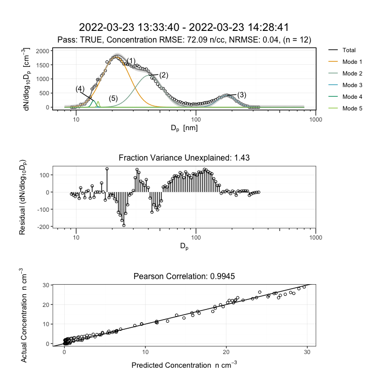

Source code for SMPS read functions are housed here <https://github.com/christopher-rapp/scripts-multimodal.git>

# Setup

## Retrieve Read Functions


``` r
devtools::source_url("https://raw.githubusercontent.com/christopher-rapp/scripts-multimodal/refs/heads/main/multimodal.R")

devtools::source_url("https://raw.githubusercontent.com/christopher-rapp/scripts-multimodal/refs/heads/main/readPSD_BMI.R")

devtools::source_url("https://raw.githubusercontent.com/christopher-rapp/scripts-multimodal/refs/heads/main/readPSD_NAS.R")

devtools::source_url("https://raw.githubusercontent.com/christopher-rapp/scripts-multimodal/refs/heads/main/readPSD_NC.R")

devtools::source_url("https://raw.githubusercontent.com/christopher-rapp/scripts-multimodal/refs/heads/main/readPSD_TSI.R")
```

## Import Libraries


``` r
library(stringr)
library(data.table)
library(tidyr)
library(dplyr)
library(lubridate)
library(logr)
library(ggplot2)
library(purrr)
library(patchwork)
library(ncdf4)
```

## User Paths

These must be changed if trying with your own data!


``` r
log.path = '~/Library/CloudStorage/Box-Box/Multimodal Curve Fitting/log/'

import.path.BMI = '~/Library/CloudStorage/Box-Box/Multimodal Curve Fitting/example/BMI/'
import.path.TSI = '~/Library/CloudStorage/Box-Box/Multimodal Curve Fitting/example/TSI/'
import.path.NC = '~/Library/CloudStorage/Box-Box/Multimodal Curve Fitting/example/netCDF/'
import.path.NAS = '~/Library/CloudStorage/Box-Box/Multimodal Curve Fitting/example/NASA-AMES/'
```

# Formatting Data

## Brechtel Manufacturing Inc. (BMI) Data


``` r
BMI.data.ls <- readPSD_BMI(import.path.BMI, tz = "US/Eastern")

# Read functions export data as a list to account for multiple files in a directory
dataPSD.BMI <- BMI.data.ls[[1]]

head(dataPSD.BMI)
```

```
##             Local Time            UTC Time #StartDate    StartTime EndDate
##                 <POSc>              <POSc>      <int>       <char>   <int>
## 1: 2023-10-31 18:15:23 2023-10-31 22:15:23     231031 18:15:23.757  231031
## 2: 2023-10-31 18:17:47 2023-10-31 22:17:47     231031 18:17:47.862  231031
## 3: 2023-10-31 18:20:11 2023-10-31 22:20:11     231031 18:20:11.965  231031
## 4: 2023-10-31 18:22:36 2023-10-31 22:22:36     231031 18:22:36.078  231031
## 5: 2023-10-31 18:25:00 2023-10-31 22:25:00     231031 18:25:00.193  231031
## 6: 2023-10-31 18:27:24 2023-10-31 22:27:24     231031 18:27:24.307  231031
##         EndTime StartSecs EndSecs Temp(K) Press(hPa) NumBins   10.16   10.49
##          <char>     <int>   <int>   <num>      <num>   <int>   <num>   <num>
## 1: 18:17:23.748        21     141  26.490    950.521     120 3420.58 3734.03
## 2: 18:19:47.858       165     285  26.466    950.415     120 3159.37 3015.60
## 3: 18:22:11.968       309     429  26.455    950.511     120 7291.97 8002.41
## 4: 18:24:36.083       453     573  26.435    950.417     120 7145.41 7368.59
## 5: 18:27:00.195       597     717  26.412    950.458     120 7046.85 7546.17
## 6: 18:29:24.306       742     862  26.409    950.604     120 2208.41 2063.78
##      10.82   11.17   11.53   11.90   12.28   12.68   13.09   13.51   13.94
##      <num>   <num>   <num>   <num>   <num>   <num>   <num>   <num>   <num>
## 1: 3931.78 4285.83 4785.94 5211.06 5268.06 4873.85 4272.60 3827.94 3760.99
## 2: 4087.27 4818.65 5183.06 5336.76 5346.21 5206.69 4998.48 4886.98 4944.24
## 3: 7251.37 6337.08 5376.83 4597.65 4178.56 4153.40 4396.36 4713.25 4961.93
## 4: 6523.60 5940.70 5641.67 5455.18 5259.88 5029.63 4781.73 4578.09 4466.42
## 5: 6556.28 5675.03 5022.23 4626.64 4408.62 4239.64 4075.71 3978.30 3973.91
## 6: 2907.14 3777.76 4616.84 5205.54 5305.98 4937.05 4398.17 4000.95 3931.87
##      14.40   14.86   15.34   15.84   16.35   16.88   17.43   17.99   18.57
##      <num>   <num>   <num>   <num>   <num>   <num>   <num>   <num>   <num>
## 1: 4106.44 4786.17 5649.61 6422.93 6777.77 6717.27 6708.59 7177.82 7989.92
## 2: 5049.88 5048.12 4945.73 4856.21 4877.03 5118.77 5683.88 6476.23 7140.36
## 3: 5073.22 5027.45 4903.05 4873.84 5070.76 5554.36 6386.57 7467.70 8367.67
## 4: 4424.22 4408.08 4513.98 4953.89 5805.99 6829.31 7542.95 7696.56 7641.66
## 5: 3991.92 3976.83 4005.68 4224.04 4727.91 5535.34 6520.87 7310.20 7577.44
## 6: 4208.82 4651.85 5008.29 5245.93 5548.47 6031.69 6648.09 7249.82 7612.15
##      19.18   19.80   20.45    21.11    21.80    22.51    23.25    24.01
##      <num>   <num>   <num>    <num>    <num>    <num>    <num>    <num>
## 1: 8548.47 8733.28 9211.15 10457.97 12012.68 12841.21 12669.16 12648.49
## 2: 7514.08 8066.04 9179.75 10343.19 11042.74 11890.38 13214.68 14357.91
## 3: 8732.85 8759.77 8792.58  9051.57  9983.58 12063.36 14492.67 15392.67
## 4: 7942.76 8795.73 9750.65 10256.04 10502.03 11103.43 12314.28 13682.46
## 5: 7667.47 8289.82 9573.20 11022.25 12169.90 13114.89 14118.46 14922.20
## 6: 7639.78 7705.24 8208.07  9024.83  9942.67 11218.32 12955.83 14377.35
##       24.79    25.61    26.45    27.31    28.21    29.14    30.10    31.10
##       <num>    <num>    <num>    <num>    <num>    <num>    <num>    <num>
## 1: 13986.12 16129.58 17227.65 17045.35 17272.03 18938.52 21684.38 23692.69
## 2: 15183.52 15898.18 16213.41 16797.10 18398.39 20293.99 21057.08 21117.08
## 3: 14657.90 14021.72 14551.29 15970.48 17511.27 19085.68 21431.74 23555.15
## 4: 15083.17 16876.54 18452.55 19452.92 20586.91 21894.61 22498.43 23233.30
## 5: 15221.22 15556.25 16922.90 19208.62 21415.54 23383.32 24749.90 24420.52
## 6: 14636.24 14337.90 14894.69 16789.12 19050.79 20696.30 21733.00 22751.64
##       32.13    33.19    34.29    35.43    36.61    37.83    39.10    40.41
##       <num>    <num>    <num>    <num>    <num>    <num>    <num>    <num>
## 1: 23181.99 22953.61 25254.42 27887.39 30067.61 32229.90 32671.72 32868.48
## 2: 23213.38 26595.63 27721.17 28408.51 29796.26 29939.27 31497.24 32851.97
## 3: 23757.11 24485.96 27037.65 29302.56 31065.86 32441.37 33273.56 34834.62
## 4: 25760.26 28023.02 27012.32 26622.12 30856.78 34567.88 34071.72 34225.12
## 5: 23573.56 24717.11 27277.00 28911.48 30296.23 32413.12 33819.28 34148.55
## 6: 24186.33 25943.83 28263.17 30151.38 30477.61 28989.20 27230.35 27257.49
##       41.76    43.17    44.62    46.13    47.69    49.31    50.98    52.72
##       <num>    <num>    <num>    <num>    <num>    <num>    <num>    <num>
## 1: 35450.00 38604.59 38953.14 39872.12 43913.64 45240.86 46239.88 47895.46
## 2: 32848.97 36334.22 38330.20 37851.80 39612.10 41868.67 43626.08 44671.76
## 3: 36850.88 38143.57 40412.24 41480.42 41738.99 42380.16 44951.39 47878.62
## 4: 35305.43 36483.99 40160.20 40913.30 41338.65 43762.25 45823.24 47474.99
## 5: 35653.22 39005.12 40350.96 41288.66 41667.12 41604.13 42420.06 44916.30
## 6: 29868.46 34058.13 38195.04 41527.81 40805.77 40652.88 41817.84 43309.53
##       54.52    56.39    58.33    60.34    62.43    64.59    66.84    69.18
##       <num>    <num>    <num>    <num>    <num>    <num>    <num>    <num>
## 1: 48281.58 50674.20 52528.16 50908.68 50761.38 49602.70 50528.73 52279.97
## 2: 45577.47 46407.03 46156.82 47093.80 49093.31 50892.83 50109.76 54196.07
## 3: 47918.56 47875.31 49415.92 48505.99 47098.50 48811.16 50357.77 51081.66
## 4: 48298.86 50519.05 53224.56 50885.04 47354.77 50035.90 51154.73 50535.06
## 5: 46813.32 49133.65 49786.21 51540.26 50666.08 54057.69 57616.11 54979.51
## 6: 44099.67 44213.12 43783.88 49945.58 53104.36 52352.23 55076.31 51120.83
##       71.60    74.12    76.74    79.46    82.29    85.24    88.30    91.49
##       <num>    <num>    <num>    <num>    <num>    <num>    <num>    <num>
## 1: 50352.99 48915.17 49036.42 47895.21 45138.51 42063.32 41833.62 41722.89
## 2: 53978.99 50493.50 48187.22 44805.96 43748.55 43132.88 41691.31 39140.19
## 3: 52832.49 50063.21 47126.57 47528.52 45807.05 46552.90 45463.66 43382.42
## 4: 49539.02 49384.89 47012.91 47039.31 48432.25 47355.53 43283.66 42326.72
## 5: 54723.19 54407.00 54407.02 51001.54 47072.40 48224.70 42988.93 42028.12
## 6: 53844.64 54517.47 47695.84 48707.64 49135.27 45931.29 44152.33 41760.10
##       94.80    98.26   101.86   105.61   109.52   113.60   117.86   122.30
##       <num>    <num>    <num>    <num>    <num>    <num>    <num>    <num>
## 1: 39969.75 35038.72 32446.79 32587.17 30219.92 33671.06 33991.86 31547.75
## 2: 37680.04 31840.54 34578.53 32434.63 36885.01 36445.42 34801.38 31460.89
## 3: 38850.88 36612.29 36634.99 35406.63 34316.29 35955.79 32048.60 30834.88
## 4: 41253.58 37798.44 36200.26 34462.05 33798.13 35368.46 35001.89 31128.95
## 5: 39703.71 36910.56 34052.27 36365.87 38649.88 35738.99 35325.53 31006.84
## 6: 36851.33 35329.81 35153.62 33348.54 37888.60 35243.59 34359.17 34295.79
##      126.94   131.79   136.85   142.15   147.69   153.49   159.56   165.93
##       <num>    <num>    <num>    <num>    <num>    <num>    <num>    <num>
## 1: 27432.75 28020.87 31142.28 32206.87 33388.63 31906.87 27556.64 21712.79
## 2: 27405.51 26126.54 27194.69 31262.51 31840.73 29377.42 25640.83 20579.79
## 3: 30856.82 27673.98 28863.90 30873.96 33176.87 33095.38 27237.82 20676.43
## 4: 31438.97 28104.94 28422.75 31550.96 32987.19 33022.69 26099.18 21490.21
## 5: 31225.77 28995.79 30330.49 32069.83 32074.74 33180.79 28002.80 21229.33
## 6: 34255.16 31391.69 32262.48 35523.92 36315.22 34053.78 30792.82 24445.10
##      172.59   179.59   186.92   194.62   202.71   211.21   220.14  229.54
##       <num>    <num>    <num>    <num>    <num>    <num>    <num>   <num>
## 1: 19280.14 20543.98 20651.60 19030.09 16269.33 12139.91  8732.44 4561.59
## 2: 20773.91 21115.16 20380.08 19801.21 18840.94 14031.73  9938.76 6253.27
## 3: 21683.90 23658.16 25327.43 23842.45 19942.16 16333.91 12696.32 7650.79
## 4: 19329.21 20022.26 20520.26 22393.30 20091.52 15331.79 10676.07 6659.61
## 5: 21184.50 22315.74 24783.85 24756.46 19801.98 15676.01 10671.15 6076.28
## 6: 20811.07 23654.21 23256.48 25116.91 18546.70 13154.91 11376.66 8653.37
##     239.44  249.85  260.82   272.39   284.59   297.45   311.03   325.37
##      <num>   <num>   <num>    <num>    <num>    <num>    <num>    <num>
## 1: 2873.65 3003.38 5532.21 17202.01 40744.48 60474.39 73052.66 67931.15
## 2: 3858.99 3109.18 5901.98 18149.35 39104.25 62219.36 72902.43 68268.13
## 3: 3905.74 3666.30 7276.22 20093.63 37902.27 61023.07 74393.81 66100.27
## 4: 4263.19 4177.95 7186.87 16972.94 40544.63 61328.13 70400.53 65854.64
## 5: 4027.26 4348.13 6070.95 17347.98 37584.21 61411.90 73498.74 67506.95
## 6: 5734.11 4079.36 6781.74 17969.24 40607.33 63940.04 77308.55 68125.98
##      340.52   356.53   373.46   391.36  410.30  430.34  451.56  474.03  497.83
##       <num>    <num>    <num>    <num>   <num>   <num>   <num>   <num>   <num>
## 1: 48048.68 31763.35 18487.14  9178.38 5363.63 3381.23 3259.09 4331.26 5111.66
## 2: 47841.06 30071.61 16786.55  9125.37 5836.74 3570.41 2698.44 3306.43 4627.42
## 3: 46664.94 32120.27 17603.53 10592.59 5481.44 3070.19 2597.24 3497.24 3810.38
## 4: 47402.11 33812.84 19663.36  9710.91 5916.86 3928.15 2984.95 3203.95 4999.13
## 5: 49807.95 31643.16 18237.92  9933.42 6239.27 2752.77 3720.83 4089.52 4663.98
## 6: 48837.00 33299.19 19291.92 11030.60 6025.11 3592.56 4514.76 5593.17 4698.33
##     523.04  549.76  578.09  608.12 639.96 673.74 709.57 747.59 787.94 830.76
##      <num>   <num>   <num>   <num>  <num>  <num>  <num>  <num>  <num>  <num>
## 1: 3996.63 3495.25 2421.18 1041.61 542.10 457.46 490.19 136.88  34.25 157.63
## 2: 4165.94 3149.61 1438.42 1009.10 601.28 536.62 359.14 235.85 224.78  62.12
## 3: 3624.72 3009.17 1071.64  587.13 234.54 398.96 410.90 213.38 332.68  76.72
## 4: 3769.93 3194.02 1893.51  914.24 547.04 365.28 169.72 221.69 199.39  40.96
## 5: 3670.90 2798.97 1762.13  449.38 586.24 773.44 398.76 164.58  80.64 134.43
## 6: 4794.93 2871.07 1847.37  956.91 858.19 510.44 478.79 310.43 381.14  36.52
##    876.23 NumFlag    Units Size Range
##     <num>   <int>   <char>      <num>
## 1:  77.70       0 dNdlogDp     866.07
## 2:  58.30       0 dNdlogDp     866.07
## 3:  57.90       0 dNdlogDp     866.07
## 4:   5.39       0 dNdlogDp     866.07
## 5:  18.44       0 dNdlogDp     866.07
## 6:   3.90       0 dNdlogDp     866.07
```

## TSI Data

Use example data from Storm Peak Laboratory for a new particle formation event (NPF) on 2022-03-23 MDT.


``` r
TSI.data.ls <- readPSD_TSI(import.path.TSI, tz = "US/Mountain")

# Read functions export data as a list to account for multiple files in a directory
dataPSD.TSI <- TSI.data.ls[[1]]

head(dataPSD.TSI)
```

```
##             Local Time            UTC Time Sample #     Date Start Time
##                 <POSc>              <POSc>    <int>   <char>     <char>
## 1: 2022-03-23 00:03:41 2022-03-23 06:03:41    22042 03/23/22   00:03:41
## 2: 2022-03-23 00:08:40 2022-03-23 06:08:40    22043 03/23/22   00:08:40
## 3: 2022-03-23 00:13:40 2022-03-23 06:13:40    22044 03/23/22   00:13:40
## 4: 2022-03-23 00:18:41 2022-03-23 06:18:41    22045 03/23/22   00:18:41
## 5: 2022-03-23 00:23:41 2022-03-23 06:23:41    22046 03/23/22   00:23:41
## 6: 2022-03-23 00:28:41 2022-03-23 06:28:41    22047 03/23/22   00:28:41
##    Sample Temp(C) Sample Pressure(kPa) Mean Free Path(m) Gas Viscosity(Pa*s)
##             <num>                <num>             <num>               <num>
## 1:           21.8                 65.0      1.042800e-07        1.826716e-05
## 2:           21.8                 64.9      1.044406e-07        1.826716e-05
## 3:           21.7                 65.0      1.042511e-07        1.826237e-05
## 4:           21.8                 65.0      1.042961e-07        1.826716e-05
## 5:           21.6                 65.0      1.042061e-07        1.825759e-05
## 6:           21.8                 65.1      1.042319e-07        1.826716e-05
##    Diameter Midpoint  9.14  9.47  9.82  10.2    10.6    10.9    11.3    11.8
##               <lgcl> <num> <num> <num> <num>   <num>   <num>   <num>   <num>
## 1:                NA     0     0     0     0   0.000 197.349 165.190   0.000
## 2:                NA     0     0     0     0   0.000   0.000   0.000 139.885
## 3:                NA     0     0     0     0   0.000   0.000   0.000   0.000
## 4:                NA     0     0     0     0   0.000   0.000   0.000 139.686
## 5:                NA     0     0     0     0 239.221   0.000 165.063 139.563
## 6:                NA     0     0     0     0   0.000 197.246   0.000   0.000
##       12.2    12.6     13.1      13.6    14.1     14.6     15.1     15.7
##      <num>   <num>    <num>     <num>   <num>    <num>    <num>    <num>
## 1: 119.149 205.893 537.7770 1100.4600 731.200 1264.100 1272.090 1045.530
## 2:   0.000   0.000  89.7529  865.7820 695.574  534.916  817.785 1075.470
## 3: 238.234 205.841 896.0800   78.5859 972.367  827.438  696.483  846.219
## 4: 476.667 308.884 448.2090  393.0710 555.828  864.461  536.244  910.998
## 5: 238.134 308.638 716.5930  549.9040 555.448  802.190  870.332 1057.760
## 6: 238.190 102.902 627.1480  892.1420 600.387 1278.010  845.519  946.997
##        16.3     16.8     17.5     18.1     18.8     19.5     20.2     20.9
##       <num>    <num>    <num>    <num>    <num>    <num>    <num>    <num>
## 1:  945.511  705.087  750.964 1029.850 1136.800 1121.590  798.448  811.939
## 2:  585.939  662.720  853.130 1087.340 1063.430  978.252  824.356  778.284
## 3:  810.294  746.247  825.571 1014.800  788.091  714.964  755.608  822.320
## 4: 1497.180 1022.380 1423.590  947.111 1008.230  818.397  800.194  931.906
## 5: 1266.740  852.461 1021.970 1116.670 1166.100 1222.520  971.384 1035.850
## 6: 1169.030  746.401  924.198 1007.570  900.127  993.537 1021.950  538.486
##       21.7    22.5    23.3    24.1     25.0     25.9     26.9     27.9     28.9
##      <num>   <num>   <num>   <num>    <num>    <num>    <num>    <num>    <num>
## 1: 552.977 936.257 772.250 753.779  970.894  991.501  821.234  912.458  994.252
## 2: 686.882 787.487 885.758 771.547 1064.100  516.136  673.900  963.984  852.055
## 3: 893.441 948.449 942.425 746.502  739.741  982.018  874.202 1071.140 1079.850
## 4: 748.017 534.817 780.669 896.600  986.982  870.489  989.264  893.928 1139.280
## 5: 847.582 796.664 942.216 864.329  818.518  901.165  894.329 1050.530 1009.270
## 6: 793.556 892.247 710.593 817.135  759.351 1218.100 1062.580 1030.360  881.614
##        30.0     31.1     32.2     33.4     34.6     35.9     37.2    38.5
##       <num>    <num>    <num>    <num>    <num>    <num>    <num>   <num>
## 1: 1101.620 1059.470 1051.010 1110.000  874.964  772.121  923.254 830.352
## 2:  810.815  982.204 1129.770 1156.650 1147.190 1030.990  927.985 740.158
## 3:  814.663 1103.450 1130.750  995.607 1097.650 1117.610  871.307 764.166
## 4: 1222.570  824.732 1097.810  896.415  898.849  909.217 1095.970 714.966
## 5: 1164.170 1033.240  893.356  911.370 1023.610 1028.900  778.422 642.334
## 6:  904.722  940.746  883.367 1218.180 1000.030  989.585  751.879 784.413
##       40.0    41.4    42.9    44.5    46.1    47.8     49.6    51.4     53.3
##      <num>   <num>   <num>   <num>   <num>   <num>    <num>   <num>    <num>
## 1: 704.077 543.343 532.085 413.761 340.885 192.353 203.8520 149.168 199.1210
## 2: 589.793 597.713 440.377 322.472 258.539 266.625 214.3630 199.551 160.5590
## 3: 655.200 517.612 335.643 361.668 248.236 249.078 149.7990 114.920 124.5500
## 4: 803.899 539.732 422.166 350.520 360.424 266.994  97.3948 193.785 105.5690
## 5: 663.602 580.939 464.785 251.628 277.625 220.313 169.5690 212.348 109.7310
## 6: 647.183 477.660 506.529 327.103 286.743 264.709 214.7340 159.438  79.7374
##        55.2     57.3     59.4     61.5    63.8     66.1    68.5    71.0    73.7
##       <num>    <num>    <num>    <num>   <num>    <num>   <num>   <num>   <num>
## 1:  97.9716 106.3630 154.9910 153.8300 145.934 233.5010 232.727 184.466 155.427
## 2: 146.3700 112.1270 137.2040 118.8250 122.510  80.3680 152.510 103.625 209.588
## 3: 105.6750  54.4646 101.7230 104.1780 152.435 134.3620 196.023 186.525 139.293
## 4:  93.0872 121.1920  81.2171  99.5188 141.156  94.9131 223.259 135.609 184.474
## 5:  74.0632 131.2950 132.4830 115.4640 175.797  71.8226 167.940 169.304 141.137
## 6: 126.9810 134.5350 113.8760 126.8410 109.639 123.8490 128.060 108.854 278.049
##       76.4    79.1    82.0    85.1    88.2    91.4    94.7    98.2   101.8
##      <num>   <num>   <num>   <num>   <num>   <num>   <num>   <num>   <num>
## 1: 160.150 190.965 210.829 258.099 297.700 253.898 288.489 330.759 301.084
## 2: 152.934 234.367 185.909 185.675 245.477 339.798 348.205 333.769 382.287
## 3: 151.405 241.164 232.721 235.929 248.013 329.950 258.245 407.918 293.789
## 4: 134.784 215.345 229.982 320.966 335.539 328.506 239.511 310.813 301.674
## 5: 187.564 254.811 249.418 340.641 278.084 221.111 205.900 296.925 257.330
## 6: 148.768 231.010 165.701 228.159 256.833 301.819 242.626 262.261 279.860
##      105.5   109.4   113.4   117.6   121.9   126.3   131.0   135.8   140.7
##      <num>   <num>   <num>   <num>   <num>   <num>   <num>   <num>   <num>
## 1: 365.322 304.885 315.507 288.473 305.216 231.640 195.869 192.862 249.229
## 2: 350.268 326.903 391.164 310.955 336.524 325.825 337.661 283.029 295.786
## 3: 325.951 370.892 273.395 309.865 265.613 261.247 320.133 288.952 284.883
## 4: 283.761 310.761 297.287 348.271 267.395 312.350 319.894 226.978 297.472
## 5: 319.653 334.636 303.913 309.348 275.987 301.593 247.608 227.335 250.395
## 6: 393.031 245.679 301.759 252.979 342.495 265.423 250.865 321.399 233.386
##      145.9   151.2   156.8   162.5   168.5   174.7    181.1    187.7    194.6
##      <num>   <num>   <num>   <num>   <num>   <num>    <num>    <num>    <num>
## 1: 260.072 201.171 204.748 175.090 238.277 136.991 111.7630 138.5130  83.9202
## 2: 226.807 230.971 237.514 202.594 146.391 153.754 165.2710  92.9477 107.3920
## 3: 229.934 188.236 195.393 181.404 105.471 167.408 127.0000 156.6190  98.8299
## 4: 262.732 249.206 235.344 233.248 185.762 167.274 148.6380  95.8195 115.1420
## 5: 185.565 232.205 198.869 164.970 137.844 158.655  92.3299  92.2701  98.3238
## 6: 255.239 207.533 171.502 119.280 205.706 153.636 126.0880 117.4170 107.6480
##       201.7    209.1   216.7   224.7   232.9   241.4   250.3    259.5    269.0
##       <num>    <num>   <num>   <num>   <num>   <num>   <num>    <num>    <num>
## 1: 109.3220 121.7440 33.8008 81.0674 35.7504 20.1837 31.8373 15.79130  5.33835
## 2: 104.8160  71.4689 71.1985 33.6003 20.4320 25.8819 10.4397 15.79370 16.01750
## 3:  98.0943  81.5530 58.8758 52.8620 23.3219 35.7559 16.1332  5.26366 16.01470
## 4:  80.5776 108.6790 77.5540 28.2422 21.6584 39.6153 21.4253  8.87974 17.68660
## 5:  92.7493  73.5486 82.7527 38.1945 15.3207 20.7012 25.0776 22.07870  5.33805
## 6:  68.0021  43.5719 65.3531 47.8294 18.1787 31.0521 20.8752 10.52700  4.46073
##    278.8 289.0 299.6 310.6 322.0 333.8 346.0 Scan Up Time(s) Retrace Time(s)
##    <int> <int> <int> <int> <int> <int> <int>           <int>           <int>
## 1:     0     0     0     0     0     0     0             280              10
## 2:     0     0     0     0     0     0     0             280              10
## 3:     0     0     0     0     0     0     0             280              10
## 4:     0     0     0     0     0     0     0             280              10
## 5:     0     0     0     0     0     0     0             280              10
## 6:     0     0     0     0     0     0     0             280              10
##    Down Scan First Scans Per Sample Impactor Type(cm) Sheath Flow(lpm)
##             <lgcl>            <int>             <num>            <int>
## 1:           FALSE                1            0.0457               10
## 2:           FALSE                1            0.0457               10
## 3:           FALSE                1            0.0457               10
## 4:           FALSE                1            0.0457               10
## 5:           FALSE                1            0.0457               10
## 6:           FALSE                1            0.0457               10
##    Aerosol Flow(lpm) CPC Inlet Flow(lpm) CPC Sample Flow(lpm) Low Voltage
##                <int>               <int>                <int>       <num>
## 1:                 1                   1                    1     10.6730
## 2:                 1                   1                    1     10.6568
## 3:                 1                   1                    1     10.6732
## 4:                 1                   1                    1     10.6714
## 5:                 1                   1                    1     10.6749
## 6:                 1                   1                    1     10.6779
##    High Voltage Lower Size(nm) Upper Size(nm) Density(g/cc)  Title Status Flag
##           <num>          <num>          <num>         <num> <lgcl>      <char>
## 1:      9855.99        8.97687        352.269           1.2     NA Normal Scan
## 2:      9848.78        8.97687        352.269           1.2     NA Normal Scan
## 3:      9854.71        8.97687        352.269           1.2     NA Normal Scan
## 4:      9855.27        8.97687        352.269           1.2     NA Normal Scan
## 5:      9854.15        8.97687        352.269           1.2     NA Normal Scan
## 6:      9858.15        8.97687        352.269           1.2     NA Normal Scan
##    td(s)   tf(s) D50(nm) Median(nm) Mean(nm) Geo.Mean(nm) Mode(nm)
##    <num>   <num>   <num>      <num>    <num>        <num>    <num>
## 1: 1.779 2.25624 265.182    28.1484  43.6574      32.2018  15.1247
## 2: 1.779 2.25624 265.018    30.2327  46.9183      34.8112  33.3762
## 3: 1.779 2.25624 265.163    29.0698  45.3157      33.6499  32.1968
## 4: 1.779 2.25624 265.166    28.6246  45.0059      33.1420  16.2531
## 5: 1.779 2.25624 265.160    27.3360  42.4647      31.5314  16.2531
## 6: 1.779 2.25624 265.231    27.7849  43.3304      32.1639  14.5902
##    Geo.Std. Dev. Total Conc.(#/cc) Comment    Units Size Range
##            <num>             <num>  <lgcl>   <char>      <num>
## 1:       2.04694           638.399      NA dNdlogDp     336.86
## 2:       2.04897           589.268      NA dNdlogDp     336.86
## 3:       2.03663           598.152      NA dNdlogDp     336.86
## 4:       2.05389           626.208      NA dNdlogDp     336.86
## 5:       2.02267           634.772      NA dNdlogDp     336.86
## 6:       2.02913           615.324      NA dNdlogDp     336.86
```

## netCDF Data

Data were obtained from the Atmospheric Radiation Measurement (ARM) User Facility, a U.S. Department of Energy (DOE) Office of Science user facility managed by the Biological and Environmental Research Program.

SGP SMPS data were obtained from the Atmospheric Radiation Measurement (ARM) User Facility, a U.S. Department of Energy (DOE) Office of Science user facility managed by the Biological and Environmental Research Program.

Kuang, C., Singh, A., Howie, J., Salwen, C., & Hayes, C. Scanning mobility particle sizer (AOSSMPS), 2016-11-15 to 2025-06-23, Southern Great Plains (SGP), Lamont, OK (Extended and Co-located with C1) (E13). Atmospheric Radiation Measurement (ARM) User Facility. [https://doi.org/10.5439/1476898](https://nam04.safelinks.protection.outlook.com/?url=https%3A%2F%2Fdoi.org%2F10.5439%2F1476898&data=05%7C02%7Crapp5%40purdue.edu%7C3169aa02ccec49c7f95308ddb347fdca%7C4130bd397c53419cb1e58758d6d63f21%7C0%7C0%7C638863843967247118%7CUnknown%7CTWFpbGZsb3d8eyJFbXB0eU1hcGkiOnRydWUsIlYiOiIwLjAuMDAwMCIsIlAiOiJXaW4zMiIsIkFOIjoiTWFpbCIsIldUIjoyfQ%3D%3D%7C0%7C%7C%7C&sdata=ALFii3068kvIqc5dG4sN68sjbu3pqHGaYbM90rr5aFM%3D&reserved=0)


``` r
NC.data.ls <- readPSD_NC(import.path.NC)

# Read functions export data as a list to account for multiple files in a directory
dataPSD.NC <- NC.data.ls[[1]]

head(dataPSD.NC)
```

```
##                  Time   10.55    10.9    11.3   11.75    12.2    12.65    13.1
## 1 2023-07-19 00:00:01 229.408 548.848 262.211 884.073 530.819  794.500 763.913
## 2 2023-07-19 00:05:00 114.746 299.476 218.582 461.397 597.981  531.017 921.694
## 3 2023-07-19 00:10:00 230.551 451.271 526.986 502.107 579.764  938.770 849.747
## 4 2023-07-19 00:15:00 115.809 352.599 397.037 310.385 445.339 1003.796 908.580
## 5 2023-07-19 00:20:00 114.704 249.476 305.913 768.758 543.062  753.482 818.479
## 6 2023-07-19 00:25:00 347.944 353.094 309.220 388.476 411.583  639.520 854.460
##      13.55    14.05     14.6    15.15     15.7    16.25    16.85     17.5
## 1 1121.157 1130.514 1211.083 1389.714 1453.444 1709.798 1621.780 1876.027
## 2  736.839 1214.537 1172.016 1166.224 1471.679 1399.218 1331.886 1919.116
## 3  964.090  993.853 1014.759 1132.285 1231.431 1539.507 1618.466 1654.262
## 4 1106.781 1338.346 1124.499 1145.662 1598.000 1301.520 1320.362 1795.484
## 5  682.445 1086.181  929.296 1274.957 1257.640 1441.239 1507.432 1662.602
## 6  738.635 1046.237  923.729 1389.188 1166.476 1297.628 1539.155 1552.144
##       18.1    18.75    19.45    20.15     20.9     21.7     22.5     23.3
## 1 1764.448 2429.017 2329.730 2320.435 2426.032 2144.505 2953.922 2892.823
## 2 2078.902 1784.736 2238.934 2599.956 2238.237 2729.816 2568.009 2865.300
## 3 1978.002 1924.727 2113.580 2389.900 2136.968 2457.808 2574.584 2803.770
## 4 1702.826 2441.895 1930.326 2193.416 2250.921 2491.292 2514.423 2778.490
## 5 1730.383 2237.354 1960.943 2203.576 2214.458 2177.672 2251.208 2567.292
## 6 1842.513 2022.649 1957.764 2218.728 2282.920 2335.917 2350.628 2576.894
##      24.15    25.05    25.95     26.9     27.9     28.9    29.95    31.05
## 1 3023.508 3295.483 3538.897 3728.871 4002.189 4419.072 4430.606 4916.476
## 2 2921.435 3019.030 3655.349 3642.867 4121.817 4351.931 4344.164 4808.162
## 3 2863.671 2955.779 3165.180 3597.900 3835.769 4206.578 4491.183 4772.361
## 4 2950.127 3041.181 3033.596 3525.306 3764.251 4518.231 4226.971 4906.754
## 5 2842.133 2832.622 3096.053 3368.349 3519.172 4116.027 4131.004 4908.662
## 6 3193.599 2849.140 3278.841 3570.402 3492.563 3708.533 4139.758 4553.236
##       32.2     33.4     34.6    35.85     37.2    38.55    39.95    41.45
## 1 5183.347 5586.184 5627.987 5668.352 6305.616 5850.432 5525.757 4909.097
## 2 4940.063 5348.845 5788.506 6273.896 6252.516 5840.920 5754.282 5006.534
## 3 5333.142 5527.131 5553.507 6158.542 6319.847 6255.833 5876.435 5583.143
## 4 5182.285 5376.875 5981.352 6303.903 6453.669 6093.425 6367.504 6294.676
## 5 5283.231 5743.592 5555.021 6240.056 6650.838 6758.908 6682.508 6402.453
## 6 5036.475 5258.476 6059.448 6698.119 6786.079 7332.025 7485.635 7316.705
##      42.95     44.5    46.15    47.85     49.6     51.4    53.25     55.2
## 1 4626.498 3861.933 3801.762 3259.180 3058.614 2875.609 3132.449 3321.056
## 2 4518.195 3963.110 3345.568 3221.533 2945.356 3083.876 3290.623 3431.242
## 3 4825.924 4435.265 4056.036 3627.474 3482.259 3395.029 3427.702 3578.296
## 4 5848.510 5260.221 4673.045 4295.160 3913.575 3708.291 3756.823 3770.353
## 5 6157.749 5815.503 4749.304 4416.361 4045.551 3734.515 3659.251 3759.374
## 6 6902.182 6340.164 5786.006 5161.751 4537.692 3820.945 3991.784 3805.736
##      57.25    59.35     61.5    63.75     66.1    68.55    71.05    73.65
## 1 3756.458 4388.521 4840.560 5370.918 5533.685 5802.646 5955.583 5348.883
## 2 3676.774 4480.724 4916.737 5357.544 5836.761 6005.729 5812.702 5457.548
## 3 3809.919 4494.913 4679.721 5719.344 5860.879 6114.155 5822.916 5876.069
## 4 4157.233 4528.021 4867.136 5398.713 5804.219 6060.933 5897.384 6031.204
## 5 3965.716 4435.867 4905.022 5539.349 5624.933 5966.754 6137.991 5788.471
## 6 4081.439 4503.414 4585.815 5276.229 5883.960 6018.710 5708.181 5926.518
##      76.35    79.15    82.05    85.05     88.2    91.45     94.8    98.25
## 1 5257.314 4937.997 4372.268 4001.376 3502.182 2896.232 2984.634 2654.561
## 2 5160.905 4876.296 4356.225 3935.288 3555.791 3108.744 2785.382 2623.546
## 3 5419.656 4842.824 4316.584 4053.013 3371.008 3159.801 2864.063 2725.578
## 4 5485.083 5166.305 4567.694 4043.328 3539.274 3090.468 2876.918 2712.535
## 5 5460.610 5072.785 4481.935 4258.757 3668.452 3413.873 2842.041 2818.431
## 6 5873.427 5388.537 4906.322 4201.384 3908.009 3508.810 3069.931 2626.065
##        102    105.5      109      113    117.5      122    126.5      131
## 1 2538.021 2247.618 2274.669 1937.595 1853.359 1793.009 1756.517 1516.367
## 2 2465.159 2274.896 2123.226 2074.377 1854.472 1834.397 1711.330 1537.152
## 3 2554.263 2208.979 2153.753 2129.170 2077.445 1777.651 1621.750 1664.572
## 4 2421.829 2391.145 2377.817 2051.115 2080.636 1810.110 1731.530 1682.714
## 5 2466.716 2399.010 2210.243 2042.621 2006.983 1916.026 1796.339 1709.397
## 6 2698.418 2556.055 2142.996 2162.599 2093.221 1889.757 1784.344 1628.241
##      135.5    140.5      146    151.5      157    162.5    168.5     175
## 1 1402.989 1393.854 1201.337 1232.041 1038.491  842.605  966.673 986.092
## 2 1600.321 1296.363 1412.774 1154.705 1301.814 1052.601  898.659 931.269
## 3 1698.079 1398.789 1364.831 1237.431 1172.154  977.313 1076.738 959.608
## 4 1493.433 1420.170 1301.576 1294.773 1008.620  980.325  919.513 884.260
## 5 1602.446 1392.331 1289.403 1233.346 1106.326 1178.849  859.516 979.881
## 6 1557.199 1451.036 1401.997 1243.497 1236.863 1098.424  945.006 943.942
##       181   187.5   194.5   201.5     209     217     225     233   241.5
## 1 857.364 883.544 765.581 729.769 715.337 639.000 553.750 524.392 506.776
## 2 780.790 739.892 708.611 613.622 645.240 647.817 573.260 570.102 456.216
## 3 825.174 794.066 722.401 691.995 677.901 616.601 589.802 455.427 422.744
## 4 789.248 792.965 712.277 696.179 617.265 596.020 530.092 581.154 524.253
## 5 832.008 773.040 660.379 805.312 632.536 592.711 585.909 544.394 443.887
## 6 899.463 770.290 748.299 757.026 702.633 707.764 621.278 612.352 564.387
##     250.5   259.5     269     279     289   299.5   310.5     322     334
## 1 463.636 396.987 368.449 291.418 276.257 233.573 246.820 186.964 169.124
## 2 410.224 427.664 415.029 288.641 261.489 219.244 191.458 201.809 138.921
## 3 449.623 450.036 341.147 335.495 283.009 252.993 260.690 233.852 174.338
## 4 460.110 413.281 387.842 331.133 320.346 260.985 273.399 238.332 207.620
## 5 493.967 376.266 346.639 313.250 269.700 270.287 252.098 211.557 157.856
## 6 407.486 389.319 419.432 311.440 263.083 266.570 234.922 254.118 248.421
##       346   358.5     372   385.5  399.5  414.5  429.5    445  461.5  478.5
## 1 160.291 101.170 105.324 107.734 68.150 79.852 60.160 39.428 51.185 26.116
## 2 159.808 152.503  99.196  84.170 54.522 69.440 38.929 35.846 32.906 29.848
## 3 163.470 101.103 106.541 111.226 85.528 45.314 59.347 40.653 51.390 41.204
## 4 144.812 147.345 116.648  64.477 48.086 54.477 51.485 37.128 61.633 18.804
## 5 153.238 130.405 128.471  67.953 84.560 72.909 49.544 32.259 32.905 41.040
## 6 158.702 135.787  93.337  81.461 82.450 59.505 46.381 43.364 44.232 30.091
##      496    514
## 1 49.166 11.587
## 2 26.475 34.763
## 3 18.986 27.145
## 4 38.122 19.466
## 5 34.038 11.587
## 6 41.942 23.364
```

## NASA-AMES Data

Data obtained from <https://ebas-data.nilu.no/DataSets.aspx?stations=US9050R&InstrumentTypes=smps&fromDate=1970-01-01&toDate=2025-12-31>.

The EBAS database has largely been funded by the UN-ECE CLRTAP (EMEP), AMAP and through NILU internal resources. Specific developments have been possible due to projects like EUSAAR (EU-FP5)(EBAS web interface), EBAS-Online (Norwegian Research Council INFRA) (upgrading of database platform) and HTAP (European Commission DG-ENV)(import and export routines to build a secondary repository in support of [**www.htap.org**](http://www.htap.org/)). A large number of specific projects have supported development of data and meta data reporting schemes in dialog with data providers (EU)(CREATE, ACTRIS and others). 


``` r
NAS.data.ls <- readPSD_NAS(import.path.NAS)

# Read functions export data as a list to account for multiple files in a directory
dataPSD.NAS <- NAS.data.ls[[1]]

head(dataPSD.NAS)
```

```
##             starttime             endtime pressure (hPa) temperature (K)   9.14
## 1 2022-03-22 00:00:00 2022-03-22 01:00:00         646.33          299.72 474.24
## 2 2022-03-22 01:00:00 2022-03-22 01:59:59         646.83          299.25  84.12
## 3 2022-03-22 01:59:59 2022-03-22 03:00:00         646.58          298.76   0.00
## 4 2022-03-22 03:00:00 2022-03-22 04:00:00         647.00          298.46   0.00
## 5 2022-03-22 04:00:00 2022-03-22 04:59:59         646.83          298.20   0.00
## 6 2022-03-22 04:59:59 2022-03-22 06:00:00         647.08          297.82   0.00
##     9.47    9.82    10.2    10.6    10.9    11.3    11.8    12.2    12.6
## 1 957.28 2867.13 3583.47 5114.35 6310.64 7191.34 7549.04 8580.99 8822.77
## 2 298.20  916.45 1245.15 1485.14 2468.77 2897.71 3331.94 3617.07 4289.60
## 3 120.74  189.00  529.25  605.65  796.45 1144.47 1584.89 1746.31 2045.49
## 4   0.00   94.34  133.73   75.24  198.43  312.59  320.85  275.00  400.82
## 5   0.00   31.36   25.14   40.92  168.13  238.74  299.34  346.10  351.32
## 6   0.00    0.00   25.07  122.19  151.01  210.47  278.15  342.93  542.03
##      13.1    13.6    14.1    14.6    15.1    15.7    16.3    16.8    17.5
## 1 7952.76 8010.82 8162.86 7990.85 7451.82 7584.54 7593.25 7594.88 7001.90
## 2 4424.07 4447.83 4597.11 4500.57 4620.33 4802.66 4865.29 4819.59 5048.73
## 3 2123.54 2227.72 2054.91 2302.66 2327.27 2574.78 2489.49 2572.97 2945.02
## 4  441.17  583.74  626.55  646.45  752.25  845.95  818.85  881.72 1049.40
## 5  475.65  438.01  612.68  584.59  726.27  692.28  805.44  880.78  923.34
## 6  468.29  766.36  774.15  798.08  919.40  972.99 1031.76 1092.83 1195.97
##      18.1    18.8    19.5    20.2    20.9    21.7    22.5    23.3    24.1
## 1 7125.60 7862.48 8124.80 8159.64 8364.12 8668.43 9002.40 9461.98 9622.86
## 2 5513.54 5543.39 5945.24 6631.56 6552.99 7130.38 7386.48 7614.73 7806.07
## 3 3080.90 3204.40 3573.71 3759.66 4030.89 4260.40 4499.01 4618.08 4902.01
## 4 1049.61 1210.46 1189.02 1250.51 1195.23 1263.97 1262.21 1328.49 1260.05
## 5  997.21 1153.40 1169.85 1226.61 1239.19 1358.63 1385.03 1447.41 1496.10
## 6 1343.78 1458.61 1407.93 1530.73 1582.33 1734.30 1774.63 1756.64 1859.80
##        25     25.9     26.9     27.9     28.9       30     31.1     32.2
## 1 9946.65 10164.08 10489.97 10751.10 10815.08 10605.00 10928.09 10570.33
## 2 8382.28  8610.70  8977.47  8990.91  9017.20  9184.89  9058.58  8908.22
## 3 5232.13  5463.19  5566.40  5534.47  5708.35  5517.94  5529.11  5402.95
## 4 1305.21  1373.60  1372.72  1341.94  1378.23  1410.03  1323.68  1346.79
## 5 1459.50  1536.34  1602.51  1622.83  1670.06  1636.87  1661.84  1692.39
## 6 1908.20  2064.13  2066.88  2153.87  2184.21  2167.84  2311.34  2311.05
##       33.4    34.6    35.9    37.2    38.5      40    41.4    42.9    44.5
## 1 10358.50 9783.52 9459.79 8558.29 7695.16 6851.74 5834.16 4942.83 4192.25
## 2  8438.41 8037.41 7532.57 7088.88 6175.92 5608.94 4724.73 4034.35 3385.69
## 3  4980.05 4867.38 4367.58 3831.24 3402.95 2974.85 2467.29 2100.91 1787.02
## 4  1428.47 1320.27 1200.93 1190.69 1150.40 1097.74  982.27  910.10  800.29
## 5  1676.72 1646.94 1566.61 1531.97 1458.84 1378.62 1266.97 1189.41 1029.79
## 6  2285.59 2436.51 2321.06 2303.95 2236.54 2069.25 1980.24 1747.04 1582.02
##      46.1    47.8    49.6    51.4    53.3    55.2   57.3   59.4   61.5   63.8
## 1 3382.34 2716.13 2182.88 1793.04 1464.58 1209.39 998.06 848.05 734.84 592.79
## 2 2784.91 2355.69 1772.08 1507.75 1253.15 1031.68 854.03 758.11 595.86 523.25
## 3 1423.36 1228.62  971.92  828.83  676.32  537.27 482.39 431.73 326.24 292.78
## 4  754.27  612.65  572.04  513.85  407.18  363.87 281.49 258.54 228.20 192.09
## 5  900.15  769.38  664.89  586.86  527.89  403.64 344.26 297.05 259.85 248.29
## 6 1388.00 1162.01 1037.57  901.58  715.39  633.97 520.10 452.40 379.16 336.34
##     66.1   68.5     71   73.7   76.4   79.1     82   85.1   88.2   91.4   94.7
## 1 512.72 445.46 378.32 318.03 290.38 284.55 252.50 260.34 251.02 273.03 214.79
## 2 449.11 415.56 338.35 324.20 283.20 251.22 217.34 224.30 231.22 236.16 241.40
## 3 247.59 220.45 185.24 181.72 189.66 174.19 179.05 163.21 191.91 181.62 226.92
## 4 171.30 169.45 163.22 155.08 177.27 178.84 179.88 182.70 171.43 184.97 215.76
## 5 217.41 197.53 161.24 159.57 178.57 168.03 160.96 162.04 184.80 183.87 181.94
## 6 280.22 261.75 232.72 202.27 217.25 203.28 195.96 203.14 209.34 204.90 221.08
##     98.2  101.8  105.5  109.4  113.4  117.6  121.9  126.3    131  135.8  140.7
## 1 258.38 259.50 256.63 268.92 259.48 258.36 280.98 289.10 302.29 298.64 321.96
## 2 244.99 241.06 253.38 269.55 286.54 308.75 283.43 329.53 308.09 333.24 350.34
## 3 192.55 212.90 217.24 215.47 232.49 232.15 248.19 245.20 264.20 252.14 262.13
## 4 204.90 207.46 223.79 208.16 201.93 246.67 232.52 236.46 265.16 293.46 278.25
## 5 176.06 216.26 226.13 227.97 230.01 247.26 247.21 256.99 296.23 264.36 287.18
## 6 244.08 234.17 265.16 264.20 260.05 271.70 287.46 316.44 309.72 320.14 308.20
##    145.9  151.2  156.8  162.5  168.5  174.7  181.1  187.7  194.6  201.7  209.1
## 1 335.77 353.06 328.67 362.97 360.43 363.98 350.93 346.04 332.69 320.46 298.03
## 2 329.74 352.83 367.66 350.14 357.34 364.43 327.49 334.80 338.99 293.30 288.43
## 3 290.72 276.36 318.40 294.14 301.60 310.36 297.91 285.13 275.97 266.37 233.51
## 4 281.34 291.47 291.63 275.51 286.84 307.70 264.72 247.35 218.87 204.69 159.03
## 5 273.42 293.82 296.25 292.59 307.69 297.63 286.49 273.43 247.65 197.44 170.20
## 6 311.86 322.37 339.79 318.80 334.50 342.54 300.79 297.08 250.80 249.10 211.09
##    216.7  224.7  232.9  241.4  250.3 259.5   269 278.8 289 299.6 310.6
## 1 261.44 243.50 190.16 151.17 123.31 92.10 72.33     0   0     0     0
## 2 249.12 208.33 170.19 147.77 115.52 91.64 74.70     0   0     0     0
## 3 210.80 169.81 144.35 118.50  88.52 80.92 59.73     0   0     0     0
## 4 143.56 110.82  90.40  78.33  53.16 38.25 30.68     0   0     0     0
## 5 150.52 120.76 101.64  68.88  58.16 44.93 36.39     0   0     0     0
## 6 168.26 141.73 117.16  85.99  76.30 55.52 42.99     0   0     0     0
##   numflag, no unit
## 1                0
## 2                0
## 3                0
## 4                0
## 5                0
## 6                0
```

# Running multimodal

Let's run multimodal on an example dataset using a Brechtel SEMS (Model 2002). Note the log path will need to be changed to whatever location you'd like it sent to!

## Example 1 - Laboratory Data


``` r
# Frequency is null here because I already grouped data above
# I've also removed the argument for the log.path which will default to a temporary directory created by R which is deleted upon exiting an R session
result <- multimodal.fitting(dataPSD.BMI,
                             frequency = NULL,
                             labeling = T,
                             max.iterations = 20,
                             max.modes = 6,
                             lower.limit = 10,
                             upper.limit = 1500,
                             NMRSE.threshold = 0.05,
                             FVU.threshold = 20,
                             verbose = T)
```

```
## [1] "Log Path: /var/folders/2j/rmf9p1l50wg904hz8qkpvc4m0000gn/T//Rtmp5X9R2i/multimodal20231031181523_20250808183851.log"
## [1] "Current Dataset Time: 2023-10-31 22:15:23 UTC"
## [1] "Dataset sampling frequency is 2.4 min"
## [1] "2023-10-31 22:15:23: Current Loop Iteration: 1, Remaining Variance: 94.93%, Number of Modes: 1"
## [1] "2023-10-31 22:15:23: Current Loop Iteration: 2, Remaining Variance: 3.93%, Number of Modes: 2"
## [1] "2023-10-31 22:15:23: Current Loop Iteration: 3, Remaining Variance: 2.57%, Number of Modes: 3"
## [1] "2023-10-31 22:15:23: Current Loop Iteration: 4, Remaining Variance: 1.63%, Number of Modes: 4"
## [1] "2023-10-31 22:15:23: Current Loop Iteration: 5, Remaining Variance: 1.34%, Number of Modes: 5"
## [1] "2023-10-31 22:15:23: Current Loop Iteration: 6, Remaining Variance: 1.3%, Number of Modes: 6"
## [1] "Concentration RMSE: 2132.57 n/cc"
```

``` r
# As there is only 1 data file for this set, we will flatten the list

result <- flatten(result)
```

## Outputs

The first element of result is a pass flag i.e. T or F


``` r
result$pass
```

```
## [1] TRUE
```

The second is the plot which consists of three panels


The remaining outputs are predicted data, the data used to plot curves, and evaluation parameters


``` r
head(result[[3]])
```

```
##      Dp Predicted dNdlogDp Predicted dN Actual dNdlogDp Actual dN
## 1 10.16             453.91     6.301079        4952.512  68.74969
## 2 10.49             529.09     7.117198        4985.419  67.06273
## 3 10.82             612.31     8.465744        4903.316  67.79281
## 4 11.17             709.75     9.777611        4740.169  65.30121
## 5 11.53             820.21    11.251357        4507.124  61.82717
## 6 11.90             944.94    12.899759        4250.884  58.03054
##   Residual dNdlogDp Residual dN      Ratio
## 1          4498.602    62.44861 0.09165247
## 2          4456.329    59.94553 0.10612748
## 3          4291.006    59.32707 0.12487672
## 4          4030.419    55.52360 0.14973093
## 5          3686.914    50.57581 0.18198080
## 6          3305.944    45.13078 0.22229260
```

``` r
head(result[[4]])
```

```
##      Dp Mode 1 Mode 2 Mode 3 Mode 4 Mode 5 Mode 6 dNdlogDp
## 1 10.00      0 420.26      0      0      0      0   420.26
## 2 10.01      0 422.31      0      0      0      0   422.31
## 3 10.02      0 424.37      0      0      0      0   424.37
## 4 10.03      0 426.43      0      0      0      0   426.43
## 5 10.04      0 428.50      0      0      0      0   428.50
## 6 10.05      0 430.58      0      0      0      0   430.58
```

``` r
head(result[[5]])
```

```
##   Mode Label          N      GSD       Dpg       Max   Mode  Lower  Upper Width
## 1     Mode 1  7709.7021 1.104493 317.61847 72801.737 311.03 249.85 451.56    13
## 2     Mode 2 35219.1406 1.888153  71.61388 53335.797  69.18  13.51 105.61    62
## 3     Mode 3  1299.9919 1.102360 150.90879 12544.712 147.69 126.94 172.59     8
## 4     Mode 4   906.6612 1.069269 195.75567 12079.366 194.62 165.93 272.39    12
## 5     Mode 5   715.3382 1.128914 499.31587  5631.458 497.83 430.34 830.76    13
## 6     Mode 6   140.9658 1.042290 117.38486  2934.445 117.86  98.26 136.85     9
##         BIC       RSS         TSS        R2 N T pval GSD T pval Dpg T pval
## 1  276.9295 150254441  8174258916 0.9816186    5e-12    2.3e-22   2.16e-22
## 2 1087.2011  88575112 19969539592 0.9955645    1e-65    1.1e-75   1.16e-73
## 3  152.9817   4783910    93721539 0.9489561    8e-07    2.7e-12   1.13e-12
## 4  262.9294 210120965   618259998 0.6601414    4e-03    3.1e-13   3.04e-13
## 5  212.3369   1489699    53034863 0.9719109    2e-10    2.0e-19   5.82e-20
## 6  179.0575  13928215    32875106 0.5763294    4e-02    2.1e-10   2.12e-10
```

``` r
result[[6]]
```

```
##      Pearson Correlation    RMSE      NRMSE dN RMSE   dN NRMSE Students T Test
## [1,]              0.9939 2132.57 0.02935411   37.15 0.02613263          0.8524
##      Chi-Squared
## [1,]      0.2391
```

## Example 2 - Storm Peak Laboratory


```
## [1] "Log Path: ~/Library/CloudStorage/Box-Box/Multimodal Curve Fitting/log//multimodal20220323020341_20250808183853.log"
## [1] "Current Dataset Time: 2022-03-23 06:03:41 UTC"
## [1] "Dataset sampling frequency is 5 min"
## [1] "2022-03-23 06:03:41: Error, please modify lower and upper limits to accommadate data set"
```

Notice the failure message? This is because the dataset begins for bin diameter 9.14. Now we can retry with adjusted limits.


```
## [1] "Log Path: ~/Library/CloudStorage/Box-Box/Multimodal Curve Fitting/log//multimodal20220323020341_20250808183854.log"
## [1] "Current Dataset Time: 2022-03-23 06:03:41 UTC"
## [1] "Dataset sampling frequency is 5 min"
## [1] "2022-03-23 06:03:41: Current Loop Iteration: 1, Remaining Variance: 1.11%, Number of Modes: 1"
## [1] "2022-03-23 06:03:41: Current Loop Iteration: 2, Remaining Variance: 0.82%, Number of Modes: 2"
## [1] "Concentration RMSE: 354.11 n/cc"
```

For this file there is a NPF event, but currently the averaging across the entire day removes all temporal variation. We will instead select times between 07:00 and 15:00 and use an hourly frequency.


```
## [1] "Log Path: ~/Library/CloudStorage/Box-Box/Multimodal Curve Fitting/log//multimodal20220323070340_20250808183854.log"
```

```
## $`2022-03-23 11:00:00`
```


```
## 
## $`2022-03-23 12:00:00`
```


```
## 
## $`2022-03-23 13:00:00`
```


```
## 
## $`2022-03-23 14:00:00`
```



```
## 
## $`2022-03-23 15:00:00`
```


```
## 
## $`2022-03-23 16:00:00`
```


```
## 
## $`2022-03-23 17:00:00`
```


```
## 
## $`2022-03-23 18:00:00`
```


```
## 
## $`2022-03-23 19:00:00`
```


Note - for higher resolution scans, the variation within the scan may be too high to capture. The following is an example.


```
## [1] "Log Path: ~/Library/CloudStorage/Box-Box/Multimodal Curve Fitting/log//multimodal20220323100340_20250808183906.log"
```

```
## $`2022-03-23 14:05:00`
```

```
## Warning: ggrepel: 1 unlabeled data points (too many overlaps). Consider
## increasing max.overlaps
```


